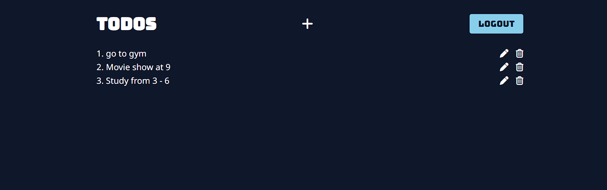
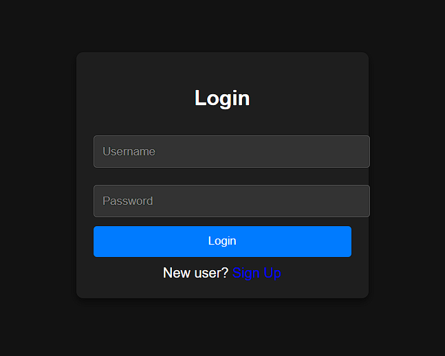
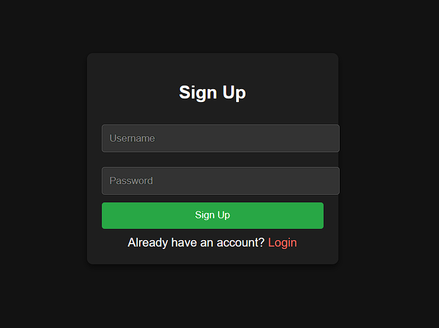

# To-Do List Application

## Table of Contents
- [Overview](#overview)
- [Features](#features)
- [Screenshots](#screenshots)
- [Installation](#installation)
- [Usage](#usage)
- [Technologies Used](#technologies-used)
- [Project Structure](#project-structure)

## Overview
This is a simple To-Do List web application that allows users to sign up, log in, and manage their tasks. It is built using HTML, CSS, and JavaScript, and stores user data in the browser's `localStorage`. The application is fully responsive for mobile and tablet devices.

## Features
- User authentication: Sign-up, login, and logout functionality.
- Add, edit, and delete tasks.
- User-specific task lists that persist after logging out and back in.
- Responsive design optimized for desktop, tablet, and mobile devices.
- Tasks are stored in `localStorage` based on the logged-in user.

## Screenshots
### Home Page (To-Do List)


### Login Page


### Sign-Up Page


## Installation
1. Clone the repository to your local machine:
    ```bash
    git clone https://github.com/Purav8055/To-Do-List
    ```
2. Navigate to the project directory:
    ```bash
    cd ToDoList/login
    ```
3. Open the `login.html` file in your web browser.

## Usage
1. **Sign-Up**: Create a new account by providing a username and password.
2. **Login**: Log in using your credentials to access your to-do list.
3. **Add Task**: Add a new task by clicking the "+" icon and entering the task.
4. **Edit Task**: Click the pencil icon next to any task to edit it.
5. **Delete Task**: Click the trash icon to remove a task.
6. **Logout**: Click the logout button to exit the session.

Your tasks will be saved in the browser's `localStorage` and will be available the next time you log in with the same credentials.

## Technologies Used
- HTML5
- CSS3
- JavaScript (ES6+)
- LocalStorage (for storing user data and tasks)

## Project Structure
```plaintext
├── home/
│   ├── home.html
│   ├── home.css
│   ├── home.js
├── login/
│   ├── login.html
│   ├── login.css
│   ├── login.js
├── signUp/
│   ├── signUp.html
│   ├── signUp.css
│   ├── signUp.js
├── images/
│   ├── login.png
│   ├── signUp.png
│   ├── todo.png
├── README.md
